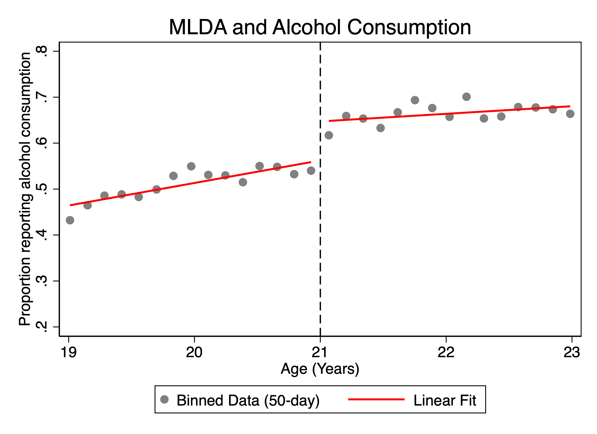
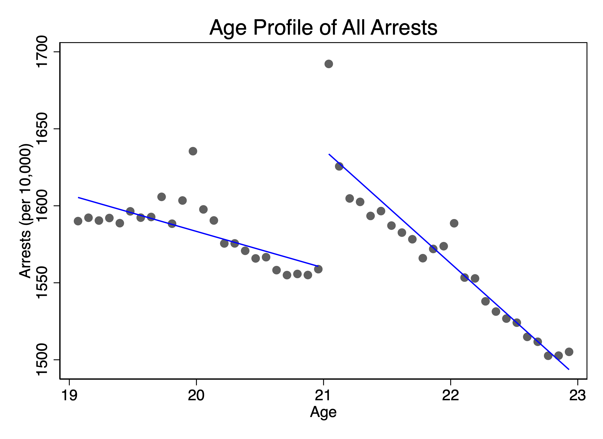

# Legal Drinking Age, Alcohol Consumption, and Arrests

**Yusuf Khatri · Stata · Regression discontinuity · Two-sample instrumental variables**

What changes when people become legally eligible to drink at 21? This project examines changes in reported alcohol consumption and California arrest rates at the legal drinking-age threshold. It then uses a two-sample instrumental variables framework to explore the relationship between drinking and arrests.

Developed for ECON 104 at UC Santa Cruz and adapted into a reproducible research portfolio project.

## Main findings

The preferred model estimates an **8.49-percentage-point increase in reported drinking at age 21**. Overall arrests increase by **76.76 per 10,000**, with increases in DUI and drunkenness-related arrests and a decrease in liquor-law arrests.

| Outcome | Estimated change at age 21 | Standard error | Units |
| --- | ---: | ---: | --- |
| Reported alcohol consumption | +8.49 | 1.40 | Percentage points |
| Overall arrests | +76.76 | 4.30 | Arrests per 10,000 |
| DUI arrests | +51.29 | 1.21 | Arrests per 10,000 |
| Drunkenness/risk-to-self arrests | +31.62 | 1.24 | Arrests per 10,000 |
| Liquor-law arrests | −71.34 | 0.52 | Arrests per 10,000 |

These are discontinuities at the age-21 threshold. The decline in liquor-law arrests needs particular care: turning 21 changes whether some behavior is an offense, independently of any change in drinking.



Reported drinking in 50-day age bins, with separate linear fits on either side of 21.



Arrest rates in 30-day age bins. This figure fits the bin means; the regression table uses the original age-level observations, so the visual gap need not exactly equal the tabulated estimate.

## Data and methods

| Source | Observation | Analytical role |
| --- | --- | --- |
| National Health Interview Survey, 1997–2007 course sample | Individual survey respondent | Alcohol consumption and demographic balance |
| California arrest-rate course dataset | Age-specific arrest rates per 10,000 | Overall and cause-specific arrest outcomes |

These are separate samples; survey respondents are not linked to arrest records. Data links, required filenames, and an arrest-CSV conversion option are in [data setup](data/README.md).

The analysis has three stages:

1. **Alcohol consumption.** Compare bin widths, age windows, and linear and quadratic models. The preferred specification uses separate linear slopes, 50-day bin means, and ages 19–23. Its regression sample contains 30 bins.
2. **Balance and arrest rates.** Examine ten demographic characteristics and estimate discontinuities in total arrests and seven categories. Balance models contain 24,069 observations; arrest models contain 1,461 age-level observations. The demographic filter uses `age_yrs`, while arrest models use age calculated from days relative to 21.
3. **Drinking and arrests.** Divide each arrest discontinuity by the drinking discontinuity and calculate delta-method standard errors, assuming independent samples.

The total-arrest IV ratio is **9.05 additional arrests per 10,000 per one-percentage-point increase in the drinking proportion** (standard error **1.57**). This interpretation depends on the assumptions below. [Complete IV estimates](outputs/tables/drinking_arrests_iv.csv) cover all eight arrest outcomes.

## Interpretation and limitations

- **Local scope.** The estimates describe changes around age 21, not the effect of changing drinking-age policy for every age group.
- **Continuity and balance.** Observable balance supports the design but does not establish continuity in unobserved characteristics. Marriage has a significant negative discontinuity; high-school completion has a weaker discontinuity that also merits attention.
- **IV assumptions.** A causal drinking effect requires relevance, continuity around the cutoff, exclusion of other channels, monotonicity, and sufficient comparability between the national survey and California arrest populations. Direct changes in liquor-law enforcement threaten exclusion for that category and complicate interpretation of total arrests.
- **Estimation choices.** The code retains unweighted bin-level first-stage estimation and ordinary OLS standard errors. It does not implement survey-design adjustments or robust bias-corrected RD inference. Results can depend on functional form and age windows.
- **Measurement.** Arrests capture recorded enforcement outcomes. Reported drinking is a participation measure; its precise recall period should be checked against the source documentation.

## Explore the results

- [Demographic balance table](outputs/tables/demographic_balance.txt)
- [Arrest regression table](outputs/tables/arrest_regressions.txt)
- [Linear and quadratic model comparison](outputs/figures/alcohol_model_comparison.png)
- [DUI and liquor-law arrest profiles](outputs/figures/dui_and_liquor_law_arrests.png)
- [IV estimates and standard errors](outputs/tables/drinking_arrests_iv.csv)
- [Excel analysis workbook](outputs/tables/MLDA%20Results.xlsx): Formula-based IV estimates, delta-method standard errors, and 95% confidence intervals, with a linked summary and chart.

## Run the project

Use the following folder structure:

| Location | Contents |
| --- | --- |
| Project root | `run_all.do` and this README |
| `code/` | Three analysis scripts |
| `data/` | Local copies of `NHIS Data.dta` and `Arrest.dta` |
| `outputs/` | Figures, tables, and generated logs |
| `docs/` | Validation and development notes |

Install the table-export dependency once, if needed:

```stata
ssc install outreg2
```

Set Stata's working directory to the project root and run the master file:

```stata
cd "/your/path/mlda-policy-analysis"
do "run_all.do"
```

The master file creates output folders and runs the scripts in order. The IV script depends on the first-stage estimates created by the alcohol-consumption script. Rerunning replaces generated results with the same filenames. Raw datasets are not included.

## Validation and project background

The completed Stata run produced the included results. First-stage, balance, and arrest estimates were checked against the original course analysis, and IV ratios and standard errors were checked independently. Four included figures were visually reviewed, including the corrected category-chart labels. Filename and comment changes in this portfolio edition were checked for consistency; the renamed workflow completed successfully in Stata and reproduced the previously checked results. See [validation details](docs/validation.md).

The research questions and datasets came from ECON 104 at UC Santa Cruz, using instructor-provided data hosted by Professor Carlos Dobkin. The analysis began as coursework. Code organization and PDF transcription were prepared with AI assistance; the IV calculation code was reconstructed from the stated method because executable IV code was absent from the original submissions. [Development notes](docs/development_notes.md) retain that history and explain the corrected calculations.
